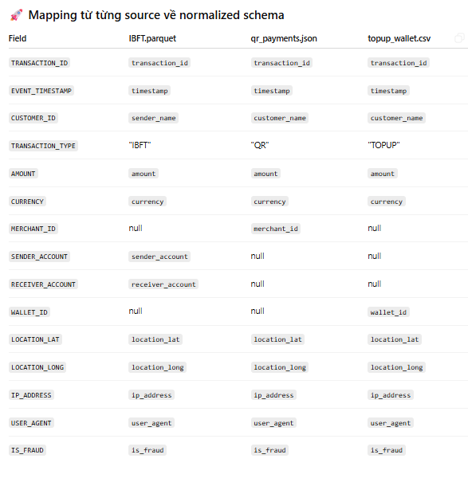

# VPBank Transaction Simulator

A mock transaction data generator for Hackathon 2025.
Assigned to: nairyuuu (Lê Trần Long)

## Overview

This project simulates banking transactions and streams them to Kafka topics for real-time processing and analysis.

## Requirements

### Input
- No input required (uses random seed or streams from existing data files)

### Output
- 3 Kafka topics for different transaction types:
  - `IBFT` - Inter-bank Fund Transfer
  - `qr_payments` - QR Code Payments  
  - `topup_wallet` - Wallet Top-up
- Messages sent in JSON format
- Random timing intervals (transactions can be sent simultaneously)

### Transaction Attributes


## Project Structure

```
mock-txn-data/
├── docker-compose.yml
├── kafka/
│   └── config/
├── src/
│   ├── __init__.py
│   ├── main.py
│   ├── producer.py
│   ├── data_generator.py
│   └── config.py
├── requirements.txt
├── README.md
├── source.png
└── .env
```

## Getting Started

1. Clone the repository
2. Install dependencies: `pip install -r requirements.txt`
3. Configure environment variables in `.env`
4. Start Kafka: `docker-compose up -d`
5. Run the simulator: `python src/main.py`

## Features

- Random transaction generation
- Configurable transaction rates
- Multiple transaction types
- Real-time Kafka streaming
- Docker containerization